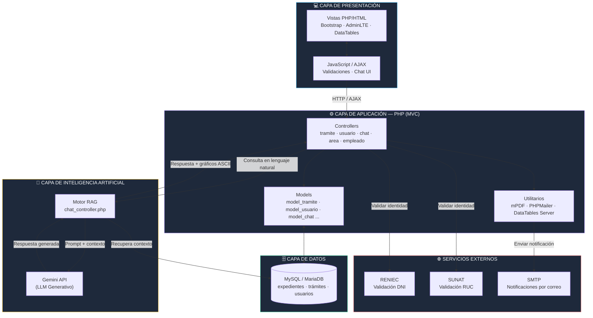
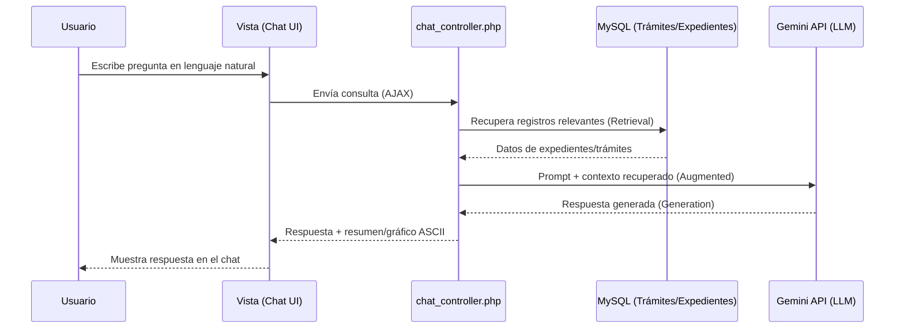

<div align="center">


# Transformación Digital en DIRESA Apurímac

### Sistema de Trámite Documentario con Firma Digital e Inteligencia Artificial (RAG)

*Optimizando la gestión pública mediante tecnología web, validación de identidad y asistencia conversacional con IA.*

</div>

---

## 📌 El Desafío (2022)

En 2022, la **Dirección Regional de Salud de Apurímac (DIRESA Apurímac)** enfrentaba cuellos de botella críticos en su gestión administrativa. El proceso manual basado en documentos físicos generaba:

| Problema | Impacto |
|---|---|
| ❌ **Lentitud extrema** | La búsqueda de documentos físicos tomaba horas o incluso días. |
| ❌ **Altos costos operativos** | Gasto excesivo en papel, impresión y almacenamiento físico. |
| ❌ **Baja satisfacción** | Usuarios frustrados por la demora en la atención de sus trámites. |

### Preguntas de investigación

> ¿De qué manera la implementación del sistema web con firma digital **reduce el tiempo de atención** de los trámites documentarios en la DIRESA Apurímac?

> ¿De qué manera la implementación del sistema web con firma digital **reduce los costos de materiales** en la gestión documentaria?

> ¿De qué manera la implementación del sistema web con firma digital **incrementa el nivel de satisfacción** de los usuarios?

---

## 💡 La Solución Tecnológica

### 🤖 Chatbot RAG (MySQL + IA Generativa)
Integración de un modelo de lenguaje (Gemini / OpenAI) con la base de datos institucional en MySQL mediante un enfoque **RAG (Retrieval-Augmented Generation)**. El sistema recupera información actualizada de los expedientes y trámites, y la utiliza como contexto para que la IA responda consultas en lenguaje natural, incluyendo resúmenes y gráficos en formato ASCII.

### 🪪 Validación de identidad (RENIEC / SUNAT)
Conexión segura mediante servicios externos hacia **RENIEC** (DNI) y **SUNAT** (RUC) para validar en tiempo real la identidad de los usuarios firmantes, garantizando seguridad jurídica en cada trámite.

### ✍️ Firma Digital
Flujo de firma digital que elimina la necesidad de papel físico, permitiendo la aprobación, derivación y seguimiento de documentos desde cualquier ubicación.

---

## 🏗️ Arquitectura del Sistema (MVC)



> 💡 El diagrama se renderiza automáticamente en GitHub (formato [Mermaid](https://mermaid.js.org/)). Si lo visualizas fuera de GitHub, usa el [Mermaid Live Editor](https://mermaid.live) pegando el bloque de código anterior.

### Flujo de una consulta al Chatbot RAG



**Stack tecnológico:**

- **Frontend:** HTML5, CSS3, JavaScript, Bootstrap, AdminLTE, DataTables
- **Backend:** PHP (patrón MVC propio)
- **Base de datos:** MySQL / MariaDB
- **Inteligencia Artificial:** Gemini API (RAG sobre datos institucionales)
- **Firma digital y PDF:** mPDF, generación y validación de documentos firmados
- **Validación de identidad:** Consultas a servicios externos de RENIEC / SUNAT
- **Notificaciones:** Envío de correos vía SMTP (PHPMailer)
- **Gestor de dependencias:** Composer

---

## 📈 Resultados e Impacto

<div align="center">

| 📉 90% | ⏱️ 60% | ⭐ 4.8 / 5 |
|---|---|---|
| **Ahorro de papel** — eliminación drástica del uso de materiales físicos | **Reducción de tiempo** — optimización del flujo de atención de trámites | **Satisfacción del usuario** — mejora significativa en la experiencia de atención |

</div>

---

## ⚙️ Instalación y configuración local

> Este repositorio **no incluye credenciales reales** (base de datos, correo o API keys). Las conexiones se publican únicamente como **plantillas de ejemplo** (`*.example.php`); cada desarrollador debe crear sus propias copias locales, las cuales están excluidas mediante `.gitignore`.

1. Clonar el repositorio y ubicarlo dentro de tu servidor local (XAMPP, WAMP, Laragon, etc.).
2. Instalar dependencias con Composer:
   ```bash
   composer install
   ```
3. Crear la base de datos en MySQL e importar la estructura del sistema (script `.sql` no incluido en el repositorio por contener datos institucionales).
4. Copiar los archivos de configuración de ejemplo y completarlos con tus propios datos:
   ```bash
   cp model/model_conexion.example.php   model/model_conexion.php
   cp config/config_email.example.php    config/config_email.php
   cp config/gemini_config.example.php   config/gemini_config.php
   ```
5. Editar cada archivo copiado con tus credenciales reales (host de BD, usuario/contraseña de correo SMTP, API Key de Gemini, etc.).
6. Levantar el servidor local y acceder al sistema desde el navegador.

---

## 🔒 Seguridad

- Las credenciales de base de datos, correo SMTP y API Keys se gestionan en archivos de configuración **ignorados por Git** (`.gitignore`).
- La validación de identidad de los firmantes se realiza contra fuentes oficiales (RENIEC/SUNAT) antes de habilitar la firma digital.
- El acceso a la IA está limitado por *rate limiting* por usuario para evitar abuso del servicio.

---

## 🎓 Contexto académico

Proyecto desarrollado como parte de un trabajo de investigación orientado a la transformación digital de la gestión documentaria en una entidad pública de salud, con énfasis en la reducción de tiempos de atención, costos operativos y mejora de la satisfacción ciudadana.

---

<div align="center">

**Sistema de Trámite Documentario — DIRESA Apurímac**

Desarrollado por Jersson Corilla

</div>
