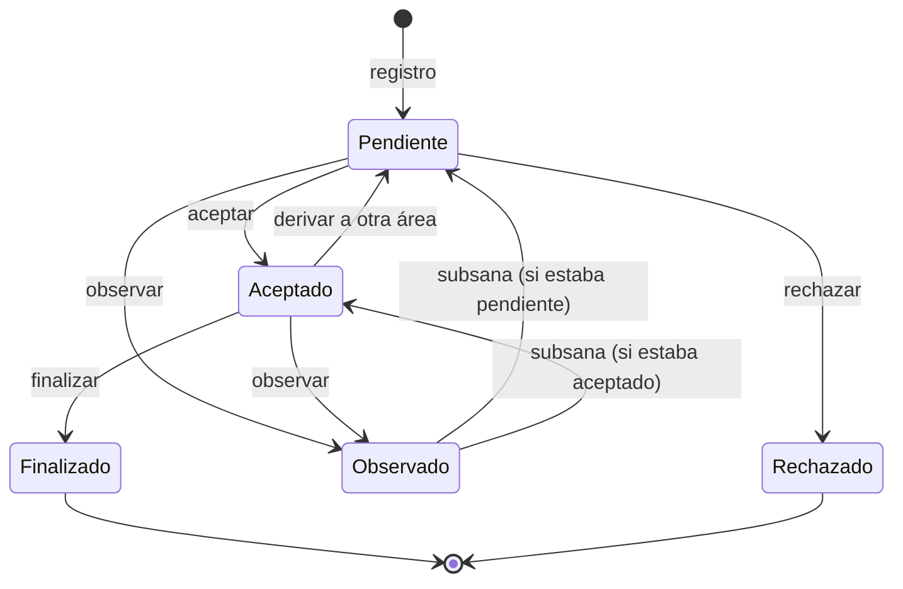

# Especificación funcional

**SISTRAMITEDOC** · Versión 2.0 · Septiembre de 2026

Describe qué hace el sistema, quién lo usa y con qué reglas. Los requisitos van numerados
(**RF** funcionales, **RN** reglas de negocio, **RNF** no funcionales) para poder citarlos en
contratos, actas y pruebas de aceptación.

---

## 1. Alcance

El sistema gestiona el ciclo completo de un trámite documentario en una entidad pública:
presentación o registro, circulación entre áreas, atención, observación y subsanación,
firma digital, respuesta, archivo y consulta, con registro de cada acción.

**Fuera del alcance de esta versión:** redacción de documentos a partir de plantillas, firma con
DNI electrónico o token (Firma Perú), consulta de RUC en SUNAT, integración con otros sistemas de
la entidad (SIAF, SIGA u otros) y aplicación móvil nativa.

## 2. Actores

| Actor | Descripción |
| --- | --- |
| Ciudadano | Persona natural o jurídica que presenta documentos y consulta su trámite por el portal público. No necesita cuenta. |
| Administrador | Configura el sistema y administra usuarios, áreas y catálogos. Ve toda la institución. |
| Jefe de Área | Responsable del área: recibe, deriva, finaliza y firma. |
| Secretario(a) | Personal administrativo del área: registra, deriva y finaliza. No firma. |
| Mesa de Partes | Recibe documentos, los registra y los deriva. No finaliza ni firma. |
| Especialista | Atiende lo que se le asigna y firma sus informes. No saca el expediente del área. |

### 2.1 Matriz de permisos

| Acción | Administrador | Jefe de Área | Secretario(a) | Mesa de Partes | Especialista |
| --- | :---: | :---: | :---: | :---: | :---: |
| Registrar trámites | ✓ | ✓ | ✓ | ✓ | ✓ |
| Derivar | ✓ | ✓ | ✓ | ✓ | — |
| Finalizar y rechazar | ✓ | ✓ | ✓ | — | — |
| Firmar digitalmente | ✓ | ✓ | — | — | ✓ |
| Observar para subsanación | ✓ | ✓ | ✓ | ✓ | — |
| Mantenimientos y configuración | ✓ | — | — | — | — |

**RN-01.** Los permisos los hace cumplir el servidor en cada operación. La pantalla además oculta
las acciones que el rol no puede hacer, pero la decisión la toma el servidor.

**RN-02.** Fuera del administrador, cada usuario solo ve los trámites que pasaron por su área.

## 3. Conceptos

| Concepto | Definición |
| --- | --- |
| Trámite | Un documento principal con sus anexos y su recorrido. |
| Expediente | Número oficial del trámite, con correlativo anual: `EXP-2026-000048`. |
| Código de seguimiento | Identificador interno del trámite: `D0000083`. |
| Procedencia | **Interno** si lo produce la entidad; **externo** si llega de un ciudadano u otra entidad. |
| Envío | Cada paso del recorrido: **principal** (el área responsable), **copia** (para conocimiento) o **atención** (se le pide respuesta). |
| Acuse | Constancia de quién recibió un envío y cuándo. |

## 4. Estados del trámite

| Estado | Significado | Siguiente estado posible |
| --- | --- | --- |
| Pendiente | Llegó al área y espera que la reciban | Aceptado, Rechazado, Observado |
| Aceptado | El área lo recibió y lo está atendiendo | Derivado a otra área (vuelve a Pendiente), Finalizado, Observado |
| Observado | Espera que el ciudadano subsane | El estado que tenía antes de observarlo |
| Finalizado | Atendido y cerrado | — |
| Rechazado | No se admitió | — |

## 5. Requisitos funcionales

### 5.1 Portal del ciudadano

**RF-01. Mesa de partes virtual.** El ciudadano registra su trámite sin cuenta: datos del remitente
(a nombre propio o como persona jurídica, con RUC y razón social), tipo y número de documento,
folios, asunto, documento principal en PDF y hasta 10 anexos en PDF.

**RF-02. Consulta de DNI al registrar.** Con la consulta configurada, al escribir el DNI se
completan los nombres y apellidos.

**RF-03. Cargo de recepción.** Al registrar, el ciudadano obtiene su N° de expediente y su código de
seguimiento, y puede descargar un cargo de recepción en PDF con código QR.

**RF-04. Aviso por correo.** Si dejó un correo, recibe la confirmación con su N° de expediente y el
enlace de seguimiento.

**RF-05. Seguimiento en línea.** El ciudadano consulta su trámite con el N° de expediente (o el
código de seguimiento) y el DNI del remitente. Ve el estado, el área actual, el plazo y el recorrido.
No ve nombres de funcionarios ni archivos internos.

**RF-06. Subsanación en línea.** Si su trámite está observado, ve qué debe corregir y hasta cuándo, y
sube el documento que falta en PDF con un comentario opcional.

**RF-07. Validación de firmas.** Cualquier persona, sin cuenta, valida una firma con el código de 10
caracteres del sello (o su QR). Ve quién firmó, cuándo y si el archivo sigue íntegro, y puede subir su
copia para comprobar que es idéntica a la firmada. No ve el documento.

### 5.2 Registro de trámites

**RF-08. Registro interno.** El personal registra un trámite indicando remitente, área de
procedencia, área de destino, tipo, número, folios, asunto, acciones a realizar, observaciones,
plazo de respuesta, copias a otras áreas, documento principal y anexos.

**RF-09. Procedencia automática.** El sistema determina si el trámite es interno o externo (ver RN-10).

**RF-10. Número automático del documento.** En un trámite interno, al elegir el tipo de documento se
propone el siguiente número del área: `001-2026-DIRESA-APURÍMAC/CONT`. El usuario puede cambiarlo si
el documento ya venía numerado.

**RF-11. Verificación de firmas al registrar.** Al elegir el PDF, el sistema comprueba las firmas
digitales que trae y muestra quién firmó y si son válidas.

**RF-12. Firma al registrar.** En un trámite interno, el usuario con permiso de firma puede firmar el
documento principal y los anexos antes de guardar (ver 5.5).

**RF-13. Acciones del trámite.** Se marcan las acciones esperadas: Atender, Tramitar, Revisar, Dar
visto bueno, Coordinar, Tomar conocimiento, Evaluar, Emitir opinión, Emitir informe, Responder,
Hacer seguimiento, Archivar.

### 5.3 Bandeja y circulación

**RF-14. Bandeja de recibidos.** Muestra los trámites dirigidos al área —como responsable, en copia o
para atención— con su estado y el semáforo de plazo. Tiene filtros por texto, tipo de documento y
fechas.

**RF-15. Aceptar.** El área de destino acepta el trámite; queda el acuse de quién lo recibió y cuándo.

**RF-16. Rechazar.** El área de destino rechaza el trámite indicando el motivo.

**RF-17. Observar.** En un trámite externo, el área indica qué debe corregir el ciudadano y un plazo
de 1 a 30 días hábiles (2 por defecto). El trámite queda Observado y se avisa al ciudadano por correo.

**RF-18. Derivar.** El área responsable envía el trámite a otra área con una descripción, acciones,
documento adjunto y anexos opcionales. En la misma derivación puede:
- enviar **copias** a otras áreas, para conocimiento;
- pedir **atención** a otras áreas, cada una con su plazo.

**RF-19. Firma al derivar.** El documento adjunto a la derivación se puede firmar antes de enviarlo.

**RF-20. Finalizar.** El área responsable cierra el trámite.

**RF-21. Confirmar recepción de copias.** Un área que recibió una copia deja constancia de que la vio,
sin cambiar el estado del trámite.

**RF-22. Responder atención.** Un área a la que se le pidió atención registra su respuesta, con un
informe en PDF opcional que puede firmar antes de enviarlo. El área responsable ve la respuesta.

**RF-23. Documentos enviados.** El área consulta todo lo que derivó.

### 5.4 Archivos del trámite

**RF-24.** El expediente muestra juntos el documento principal y los anexos, con su tamaño, fecha y
quién los subió, para ver y descargar.

**RF-25.** Los archivos de un trámite solo los ven el administrador y las áreas por las que pasó.

### 5.5 Firma digital

**RF-26. Firma con certificado.** Se firma un PDF con un certificado digital en archivo (.pfx o .p12)
y su contraseña.

**RF-27. Sello visible.** La firma agrega al PDF un sello con el nombre y DNI del firmante, la fecha,
el motivo, un código de verificación y un QR que lleva a la validación.

**RF-28. Firma de varios archivos.** Desde el expediente, un solo botón **Firmar documentos** firma los
archivos elegidos con una sola carga del certificado.

**RF-29. Cofirma.** Otro responsable puede agregar su firma a un documento ya firmado, sin invalidar
las anteriores.

**RF-30. Verificación de firmas.** En un trámite externo se ofrece **Verificar firma**, que comprueba
las firmas que el documento ya trae.

### 5.6 Rastreo

**RF-31.** El recorrido de cada trámite se ve como diagrama de flujo y como lista de movimientos.
Empieza por el origen real: el área que lo remitió, la entidad externa (con su RUC) o el ciudadano.
Muestra copias, atenciones, acuses y plazos.

### 5.7 Tablero, reportes y asistente

**RF-32. Tablero.** Indicadores y trámites que requieren atención: el administrador ve toda la
institución y cada área ve lo suyo.

**RF-33. Reportes.** Por fechas y área, por fechas y estado, por fechas y tipo de documento, y de
plazos y productividad por área. Exportables a PDF, Excel y CSV.

**RF-34. Asistente con IA.** Responde en lenguaje natural preguntas sobre los trámites, con los datos
del sistema y dentro de lo que el usuario puede ver. Apagado o sin clave, responde lo básico:
pendientes, resumen del área y búsqueda de un expediente.

**RF-35. Notificaciones.** Avisos en pantalla de los trámites pendientes, con enlace.

### 5.8 Administración

**RF-36. Usuarios.** Alta, edición, cambio de contraseña, activación y desactivación, con uno de los
cinco roles y un área.

**RF-37. Catálogos.** Empleados, áreas (con su sigla), tipos de documento y feriados.

**RF-38. Comunicados.** Avisos internos dirigidos a todos, a los administradores, al personal de áreas
o a áreas específicas, con vigencia opcional, imagen y acuse de lectura. Se muestran al entrar.

**RF-39. Bitácora.** Consulta de todas las acciones registradas, con filtros por fecha y acción.

**RF-40. Configuración.** Datos de la institución (nombre, sigla, logo, color, contacto y horario de
atención), asistente de IA, correo saliente y consulta de DNI, con prueba antes de guardar.

## 6. Reglas de negocio

**RN-10. Procedencia.** Un trámite es **interno** si el remitente tiene cuenta de usuario en el
sistema y no es una persona jurídica. En cualquier otro caso es **externo**. La casilla «Es trámite
externo» solo puede forzar externo, nunca declarar interno a un remitente sin cuenta. Los trámites del
portal ciudadano siempre son externos.

**RN-11. Solo se firma lo que produce la entidad.** Un trámite externo no se firma: el documento es
de un tercero. Solo se verifica la firma que trae.

**RN-12. Días hábiles.** Todos los plazos se cuentan en días hábiles: de lunes a viernes, sin los
feriados registrados. El plazo corre desde el día hábil siguiente a la llegada al área.

**RN-13. Horario de recepción.** Un documento presentado por el portal fuera del horario de atención
—de noche, en fin de semana o feriado— se considera presentado el siguiente día hábil a la hora de
apertura, y los plazos corren desde ahí.

**RN-14. Semáforo de plazo.** Verde si hay tiempo, ámbar si está por vencer, rojo si venció; sin
semáforo si no tiene plazo o está cerrado.

**RN-15. Numeración.** El expediente tiene un correlativo único por año para toda la institución. El
número del documento interno tiene un correlativo por área, tipo de documento y año. Dos registros
simultáneos nunca reciben el mismo número.

**RN-16. Número editable.** Si el usuario cambia el número propuesto, se guarda el suyo y no se
consume un número de la secuencia.

**RN-17. Observación.** Solo se observan trámites externos; solo uno a la vez. Al subsanar, el trámite
vuelve al estado que tenía. Si el ciudadano subsana después del plazo se acepta, pero queda anotado
como fuera de plazo y el área decide si continúa.

**RN-18. Firma.** El certificado debe estar vigente, habilitado para firmar y pertenecer al usuario:
su DNI debe coincidir con el de la ficha del empleado. La contraseña se valida antes de guardar
nada; si es incorrecta, no se registra ni se deriva nada.

**RN-19. La firma es opcional.** Si no se firma, el documento se guarda igual y la bitácora anota que
salió sin firma digital.

**RN-20. Copias del documento firmado.** Firmar desde el expediente crea una copia firmada y conserva
el original como evidencia; el original ya no se ofrece para firmar otra vez. Al registrar, derivar o
responder, el documento se firma directamente, sin copia aparte.

**RN-21. Un área responsable.** Cada trámite tiene una sola área responsable a la vez. Las áreas en
copia no deciden sobre el trámite; las áreas de atención responden, pero no derivan ni finalizan.

## 7. Requisitos no funcionales

| ID | Requisito |
| --- | --- |
| RNF-01 | Acceso por navegador web, sin instalar programas en las computadoras. |
| RNF-02 | La interfaz se adapta al celular. |
| RNF-03 | Solo se aceptan archivos PDF, validados por su contenido: hasta 20 MB por archivo y 10 anexos por envío. |
| RNF-04 | La sesión se cierra tras 2 horas sin actividad. |
| RNF-05 | El ingreso se bloquea 15 minutos tras 5 intentos fallidos. |
| RNF-06 | Todas las operaciones internas exigen sesión y un token contra falsificación de solicitudes (CSRF). |
| RNF-07 | Las páginas públicas limitan las solicitudes por dirección de internet (ver [Seguridad](08-seguridad-y-datos-personales.md)). |
| RNF-08 | Toda acción relevante queda en la bitácora con usuario, fecha, hora e IP. |
| RNF-09 | Las claves de servicios externos nunca se muestran completas ni se envían al navegador. |
| RNF-10 | El certificado digital y su contraseña no se guardan: se usan en memoria y se descartan. |
| RNF-11 | Los textos, fechas y horas se muestran en español y en hora de Perú. |
| RNF-12 | La identidad de la institución (nombre, logo, color) se configura sin modificar el código. |
