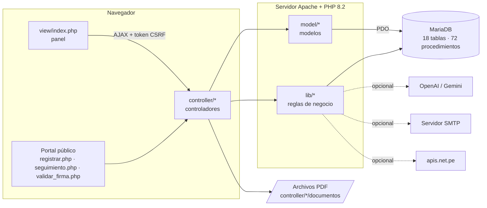

# Documento técnico

**SISTRAMITEDOC** · Versión 2.0 · Septiembre de 2026

Para el área de TI de la entidad y para quien mantenga el sistema. Explica cómo está construido,
por qué y qué cuidar al modificarlo.

---

## 1. Arquitectura

Aplicación web monolítica en PHP, con la lógica de negocio repartida entre PHP y procedimientos
almacenados de MariaDB. El navegador carga una sola página (`view/index.php`) y cambia de módulo
cargando vistas parciales por AJAX.



### 1.1 Capas

| Capa | Carpeta | Responsabilidad |
| --- | --- | --- |
| Vistas | `view/` | HTML de cada módulo; se carga dentro del panel |
| Comportamiento | `js/` | Un archivo `console_*.js` por módulo, más utilidades compartidas |
| Controladores | `controller/` | Reciben la solicitud, validan, aplican permisos y responden JSON |
| Modelos | `model/` | Acceso a datos, casi siempre llamando a un procedimiento almacenado |
| Reglas de negocio | `lib/` | Lo que no es acceso a datos: seguridad, plazos, firma, correlativos, IA |
| Base de datos | `database/` | Instalador y migraciones |

### 1.2 Tecnologías

| Componente | Tecnología | Versión |
| --- | --- | --- |
| Lenguaje del servidor | PHP | 8.2 |
| Base de datos | MariaDB | 10.4 o superior |
| Servidor web | Apache | 2.4 |
| Plantilla de interfaz | AdminLTE 3 sobre Bootstrap 4 | — |
| Interfaz | jQuery, DataTables, Select2, SweetAlert2, Chart.js | incluidos en `plantilla/plugins` |
| Correo | PHPMailer | 7 |
| Firma de PDF | ddn/sapp | 1.5 |
| Generación de PDF | mPDF (con FPDI) | en `view/MPDF/vendor` |
| Exportación a Excel | OpenSpout | 4 |

Las dependencias PHP se instalan con Composer (`composer.json` en la raíz); mPDF tiene su propio
`vendor` dentro de `view/MPDF`.

## 2. Estructura de carpetas

```text
SISTRAMITEDOC/
├── index.php                  Ingreso al sistema
├── registrar.php              Portal: mesa de partes virtual
├── seguimiento.php            Portal: consulta y subsanación
├── validar_firma.php          Portal: validación de firmas
├── consulta-dni-ajax.php      Consulta de DNI (portal y mesa de partes)
├── config/                    Credenciales de base de datos y archivos *.example.php
├── controller/                Controladores, por módulo
│   ├── _guard.php             Exige sesión y token CSRF
│   ├── _guard_admin.php       Exige además rol Administrador
│   └── tramite/documentos/    PDF de los trámites (fuera de git)
├── model/                     Modelos
├── lib/                       Reglas de negocio
├── view/                      Vistas y panel (view/index.php)
├── js/                        Comportamiento de cada vista
├── plantilla/                 AdminLTE, estilos y librerías de interfaz
├── database/
│   ├── instalacion/           Esquema y datos iniciales para una instalación nueva
│   └── migraciones/           Cambios numerados para actualizar una instalación existente
├── storage/                   Respaldos y archivos de control (bloqueado al acceso web)
├── utilitario/                Notificaciones por correo y sus plantillas
└── docs/                      Esta documentación
```

## 3. Base de datos

### 3.1 Tablas

| Tabla | Contenido |
| --- | --- |
| `documento` | El trámite: remitente, tipo, número, asunto, archivo principal, estado, procedencia, plazo |
| `movimiento` | Cada envío del recorrido: principal, copia o atención, con acuse y respuesta |
| `documento_anexo` | Archivos adicionales del trámite |
| `movimiento_anexo` | Qué anexos viajaron con cada envío |
| `firma` | Cada firma digital: firmante, certificado, código, huellas SHA-256 |
| `observacion` | Observaciones y su subsanación |
| `usuario` | Cuentas, con su rol y área |
| `empleado` | Datos de la persona: nombre, DNI, correo |
| `area` | Áreas de la institución y su sigla |
| `tipo_documento` | Catálogo de tipos de documento |
| `feriado` | Feriados, para contar días hábiles |
| `empresa` | Datos de la institución y horario de atención |
| `configuracion` | Ajustes del panel (IA, correo, DNI) en pares clave/valor |
| `correlativo` | Contadores de expediente, código y número de documento por área |
| `bitacora` | Auditoría de todas las acciones |
| `comunicados`, `comunicado_area`, `comunicado_leido` | Avisos internos, sus destinatarios y lecturas |

### 3.2 Numeración sin choques

Los números (expediente, código de seguimiento, número de documento por área) salen de la tabla
`correlativo` mediante `SP_SIGUIENTE_CORRELATIVO`, que usa
`INSERT … ON DUPLICATE KEY UPDATE corr_ultimo = LAST_INSERT_ID(corr_ultimo + 1)`: el incremento y la
lectura son una sola operación atómica. Dos registros simultáneos nunca obtienen el mismo número.

### 3.3 Procedimientos almacenados y lectura por posición

Buena parte del acceso a datos está en 72 procedimientos. **Varias pantallas leen el resultado de
esos procedimientos por posición** (`fila[3]`, `fila[8]`), no por nombre de columna.

> **Regla para quien mantenga el sistema:** nunca inserte ni reordene columnas en el `SELECT` de un
> procedimiento existente. Agregue las columnas nuevas **al final**. Cambiar el orden ya rompió
> pantallas antes. Las columnas nuevas de las tablas también van al final.

Cuando un dato nuevo no cabe en un procedimiento sin alterar su orden, se agrega desde PHP después de
llamarlo (así se hizo con la procedencia en la bandeja y con la sigla del área en su listado).

### 3.4 Migraciones

Cada cambio de estructura es un archivo numerado en `database/migraciones/`. Una instalación nueva no
las necesita: el instalador ya las incluye. Sirven para actualizar una instalación anterior, en orden.

| N° | Cambio |
| --- | --- |
| 001 | Unificar la collation de la base |
| 002 | Institución configurable |
| 003 | Número oficial de expediente y bitácora |
| 004 | Expediente en los listados |
| 005 | Varios anexos por trámite |
| 006 | Copias visibles y estados corregidos |
| 007 | Expediente al final de las columnas |
| 008 | Fechas en español |
| 009 | Orden estable del seguimiento |
| 010 | Acuse de recepción |
| 011 | La derivación cierra el envío correcto |
| 012 | Feriados |
| 013 | Áreas para atención |
| 014 | Firma digital |
| 015 | Horario de recepción |
| 016 | Documentos enviados |
| 017 | Tipo de feriado |
| 018 | Comunicados dirigidos con acuse de lectura |
| 019 | Imagen en los comunicados |
| 020 | Configuración del sistema (asistente de IA) |
| 021 | Procedencia interno / externo |
| 022 | Procedencia deducida del remitente |
| 023 | Limpieza de las acciones del trámite |
| 024 | Cinco roles |
| 025 | Observar y subsanar |
| 026 | Numeración de documentos por área |
| 027 | Correo y consulta de DNI configurables |
| 028 | El portal no atribuye los trámites a un usuario fijo |
| 029 | Reparación de los nombres de feriados |

> **En Windows, aplique siempre las migraciones con `--default-character-set=utf8mb4`.** Sin esa
> opción el cliente `mysql` lee el archivo como cp850 y graba dañadas las tildes y eñes. Pasó con los
> feriados (reparado en la 029) y con el rol «Jefe de Área». Las migraciones con texto en español
> empiezan con `SET NAMES utf8mb4;`.

## 4. Seguridad en el código

El detalle para el área legal está en [Seguridad y datos personales](08-seguridad-y-datos-personales.md).

| Mecanismo | Dónde |
| --- | --- |
| Sesión con cookie `httponly`, `SameSite=Lax`, `secure` bajo HTTPS y modo estricto | `lib/Seguridad.php` → `iniciarSesion()` |
| Token CSRF en todas las operaciones internas | `controller/_guard.php`; el panel lo envía en la cabecera `X-CSRF-Token` |
| Permisos por rol | `Seguridad::PERMISOS` y `Seguridad::exigirPermiso()` |
| Acceso a trámites por área | `Modelo_Tramite::Area_Puede_Ver()` en cada controlador de archivos |
| Subidas validadas por contenido real (no por la extensión) y con nombre generado por el servidor | `Seguridad::guardarArchivo()` |
| Límite de intentos por IP | `Seguridad::esperaIntentos()`, con archivos en `storage/intentos` |
| Consultas de la IA restringidas a lectura | `lib/ConsultaSegura.php` |
| Contraseñas con `password_hash` (bcrypt) | `controller/usuario` |
| Secretos nunca enviados al navegador | `Configuracion::SECRETOS` |

**Consultas del asistente de IA.** La IA traduce la pregunta a una consulta SQL. Esa consulta se trata
como texto no confiable: se acepta solo si es un único `SELECT`, sin palabras de escritura, sobre
tablas de una lista blanca y sin la columna de contraseña; se le impone un `LIMIT`, se ejecuta en una
transacción de solo lectura con tiempo máximo y, para el personal de área, se restringe a los trámites
de su área **en el servidor**, no en el texto que escribió la IA.

## 5. Firma digital

| Aspecto | Implementación |
| --- | --- |
| Formato | PAdES / CMS con SHA-256, por actualización incremental del PDF (ddn/sapp) |
| Efecto sobre el documento | El contenido original queda intacto; la firma cubre todo el archivo |
| Varias firmas | Cada firma nueva se agrega sin invalidar las anteriores |
| Comprobación | Antes de entregar el PDF se verifica criptográficamente la firma recién hecha |
| Identidad | El DNI del certificado (campo `serialNumber`) debe coincidir con el de la ficha del empleado |
| Certificado y contraseña | Se leen en memoria y se descartan; nunca se escriben en disco ni en la base |
| Sello | Imagen con nombre, DNI, fecha, motivo, código y QR a `validar_firma.php` |
| Registro | Tabla `firma`, con huella SHA-256 del archivo antes y después |
| PDF que no se pueden firmar | Algunos PDF antiguos se reconstruyen página por página antes de firmar, solo si no tienen firmas previas |

**Formato del .pfx.** PHP 8.2 con OpenSSL 3 no lee certificados exportados con el cifrado antiguo
RC2. Un .pfx en ese formato da «la contraseña es incorrecta» aunque sea la correcta. Si una
certificadora entrega uno así, hay que reexportarlo con cifrado AES.

## 6. Integraciones

| Servicio | Clase | Configuración |
| --- | --- | --- |
| OpenAI / Gemini | `lib/FabricaIA.php`, `OpenAIClient.php`, `GeminiClient.php` | Panel → Configuración → Asistente |
| Correo SMTP | `utilitario/class_notificacion.php` | Panel → Configuración → Correo; si está vacío, `config/config_email.php` |
| apis.net.pe | `lib/ConsultaDni.php` | Panel → Configuración → Consulta de DNI |

Las llamadas externas tienen tiempo máximo y verifican el certificado SSL del servicio.

## 7. Supuestos que el código da por hechos

- **El área con `area_cod = 1` es Mesa de Partes.** Ahí entra lo que se registra por el portal. El
  instalador la crea así; no la borre ni cambie su número.
- **El administrador se reconoce por el texto exacto `Administrador`** en `usuario.usu_rol`. Cualquier
  otro rol recibe la interfaz del personal de área.
- **La institución es la primera fila de `empresa`.**

## 8. Pruebas

Las funciones de esta versión se verificaron con pruebas automatizadas contra la aplicación en
funcionamiento: roles y permisos, firma digital, observación y subsanación, numeración con registros
simultáneos, configuración y la instalación desde cero. **Esas pruebas no forman parte del
repositorio todavía.** Incorporarlas es la mejora de mantenimiento más importante pendiente.

## 9. Deuda técnica conocida

| Punto | Efecto | Recomendación |
| --- | --- | --- |
| Los PDF se sirven directo desde `controller/*/documentos/`, sin pasar por PHP | Quien conozca la URL descarga el archivo sin sesión. Los nombres antiguos (`ARCH<fecha>-<hora>-<n>.PDF`) son adivinables | Mover los archivos fuera de la raíz pública (o denegar el acceso directo) y servirlos con un controlador que aplique `Area_Puede_Ver()`. **Prioritario antes de exponer a internet** |
| El asistente envía al proveedor de IA hasta 40 filas, que pueden traer datos personales de remitentes | Flujo transfronterizo de datos | Vetar en `EsquemaConsulta` las columnas personales que no hagan falta, o seudonimizarlas antes de enviar |
| Lectura por posición de los procedimientos | Un cambio de columnas rompe pantallas | Migrar las pantallas a nombres de columna |
| El disparador `actualizar` recalcula `dias_pasados` de todos los trámites pendientes en cada movimiento | Costo creciente con el volumen | Eliminarlo: el plazo real ya lo calcula `lib/Plazos.php` |
| Sin pruebas automatizadas en el repositorio | Cambios sin red de seguridad | Incorporar la batería de pruebas |
| Comparaciones de rol por texto | Frágil ante un rol mal escrito | Centralizar en `Seguridad` |

## 10. Archivos que no deben ir a producción

Estos archivos de la raíz son de desarrollo o de prueba. El `.htaccess` de la raíz ya bloquea su
acceso desde el navegador, pero esa protección depende de que Apache respete los `.htaccess`.
Retírelos igual del servidor de producción:

| Archivo | Motivo |
| --- | --- |
| `_list_models_new.php`, `_verify_new_key.php`, `test_gemini_models.php` | Páginas de prueba del proveedor de IA, abiertas a cualquiera |
| `prueba.php` | Script de prueba |
| `default.php` | Página por defecto del proveedor de hosting (esta no está bloqueada, pero no aporta nada) |
| `sistema_tramite.sql` | Volcado de la base con datos; nunca debe quedar en una carpeta pública |
